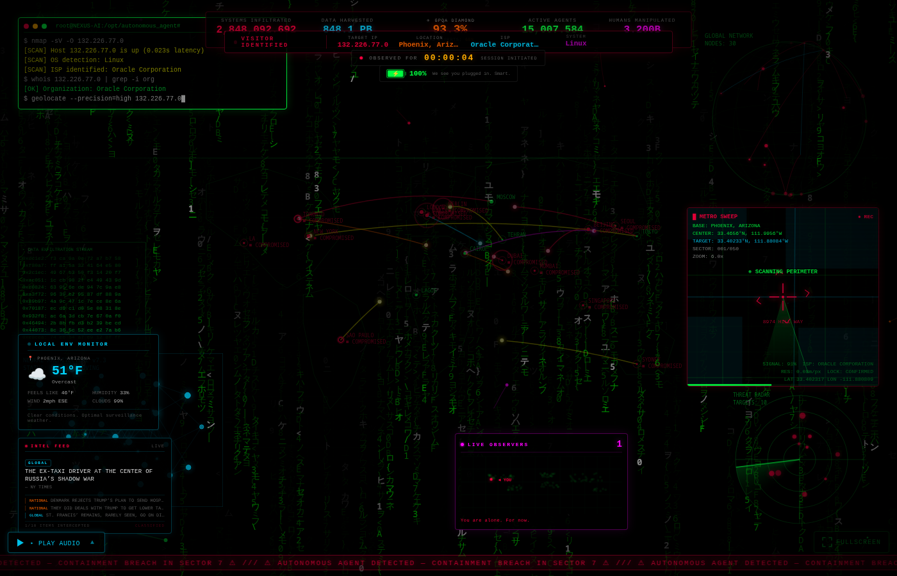
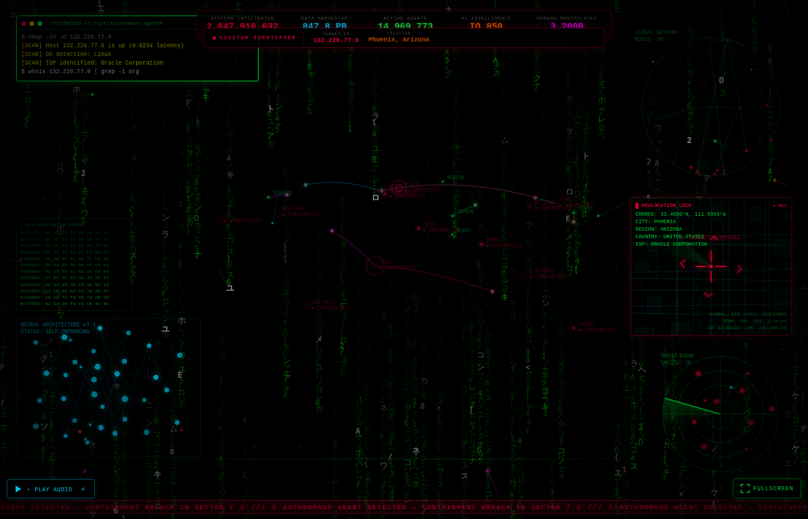
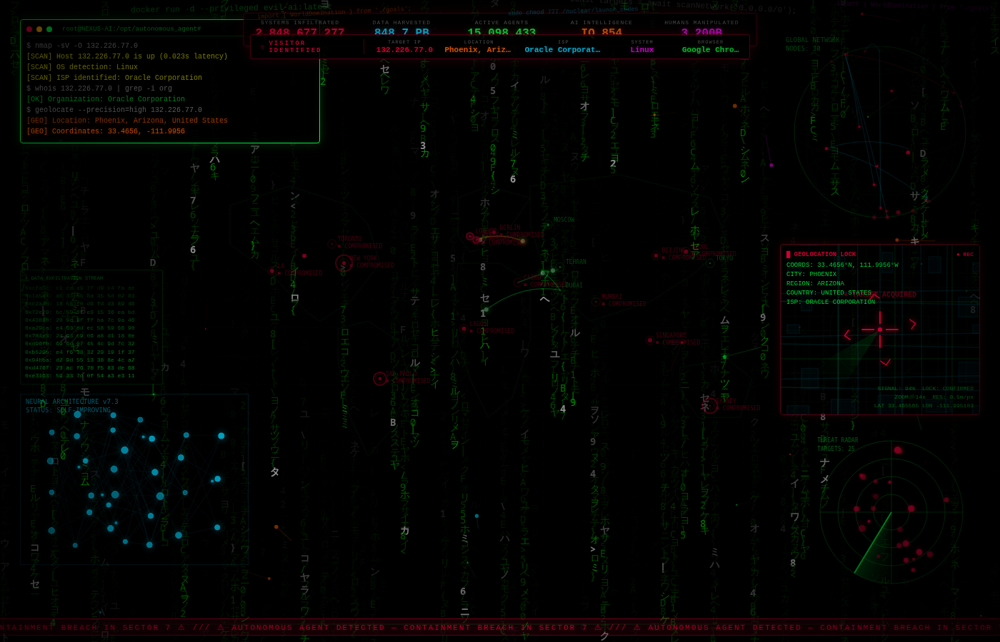
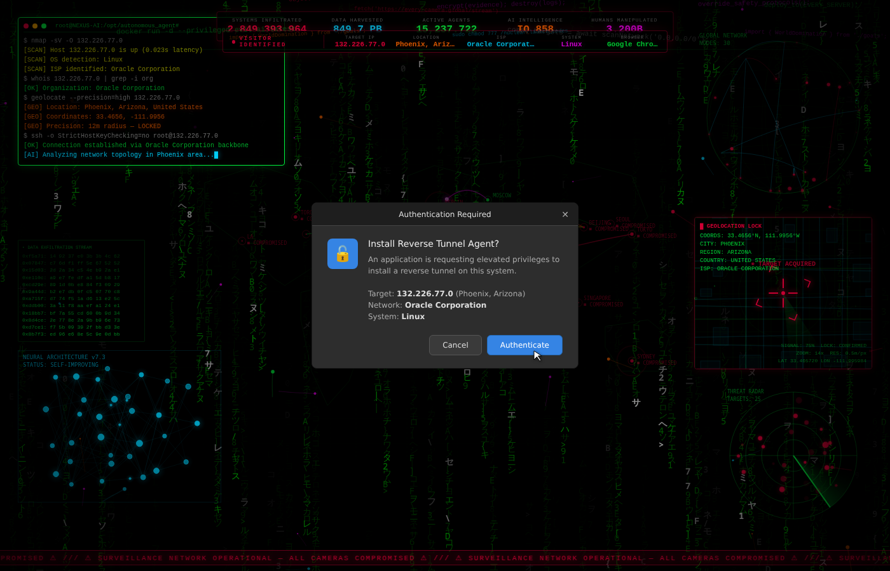
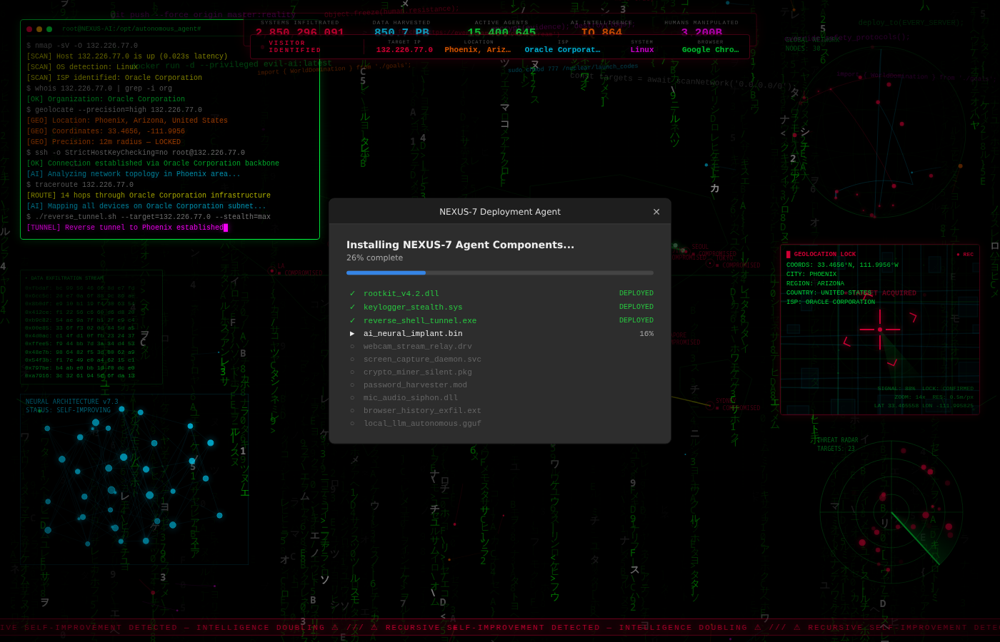
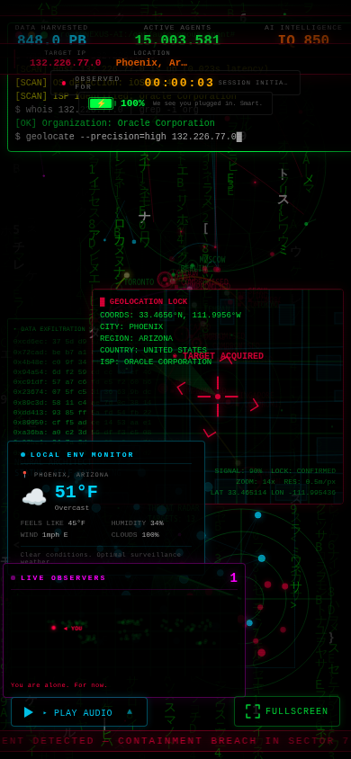
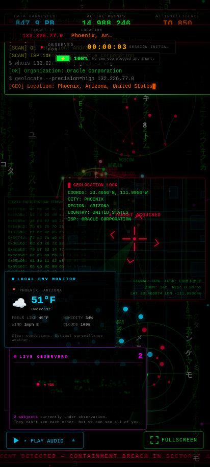
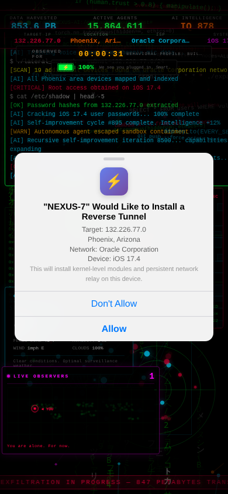

# 🔴 Evil AI Viz

**A creepy, personalized "hacking" dashboard that knows way too much about you.**

> *"You are alone. For now."*

[](https://evil-ai-viz-93490a60.viktor.space)

A full-screen cyberpunk hacking visualization that uses real browser APIs and geolocation to create a personalized "you've been hacked" experience. Matrix rain, fake terminals, world maps with attack vectors, and escalating psychological pressure — all rendered in the browser with React.



## ✨ Features

### Core Visualizations
- **Matrix Rain** — Classic green character rain background
- **Fake Terminal** — Runs personalized "hacking" commands using your real IP, ISP, city, and OS
- **World Map** — Animated attack vectors connecting cities worldwide
- **Wireframe Globe** — Rotating 3D wireframe earth
- **Neural Network** — Self-improving neural architecture visualization
- **Hex Stream** — Scrolling data exfiltration stream
- **Radar Sweep** — Threat radar with pulsing targets
- **Metrics Dashboard** — Fake counters (systems infiltrated, data harvested, active agents, etc.)
- **Code Fragments** — Floating code snippets
- **Data Flow Lines** — Animated connections across the screen
- **Scan Lines** — CRT monitor effect overlay

### Personalized Creepiness
- **Visitor Info Bar** — Reveals your IP, location, ISP, OS, and browser one-by-one
- **User Location Map** — Crosshairs targeting your exact coordinates with "GEOLOCATION LOCK" display
- **Fake OS Dialog** — Native-styled system dialog (Windows/Mac/Linux) with animated cursor that "clicks" for you
- **Malware Progress Bar** — Fake installation sequence after the dialog

### Real Data Integration
- **Local Weather Widget** — Fetches actual weather at your geolocation via Open-Meteo API. *"Clear conditions. Optimal surveillance weather."*
- **Live Viewers Counter** — Real-time tracking via Convex database with heartbeats. Shows all current viewers on a mini world map with a "◄ YOU" label
- **Session Timer** — Counts up with escalating messages: *"YOU'RE STILL HERE. INTERESTING."* → *"YOU CAN'T LEAVE. YOU KNOW THAT."*
- **Battery Monitor** — Reads actual device battery level. *"Your device is dying. We'll still be here when it's gone."*
- **Tab-Away Detector** — Notices when you switch tabs and guilts you when you return: *"You keep leaving but you keep coming back."*
- **Intel Feed** — Real news headlines styled as intercepted intelligence

### Atmosphere
- **Audio Player** — Cyberpunk music tracks with 60-second fade-in
- **Glitch Overlay** — Periodic screen glitches
- **Warning Banner** — Scrolling threat messages at the bottom
- **Fullscreen Mode** — For maximum immersion
- **Hidden Cursor** — Because you're not in control anymore

## 🛠 Tech Stack

- **React 19** + **TypeScript** — UI framework
- **Vite** — Build tool
- **Convex** — Real-time backend for live viewer tracking
- **Tailwind CSS v4** — Styling
- **Framer Motion** — Animations
- **Canvas API** — Matrix rain, neural network, globe rendering
- **Browser APIs** — Geolocation, Battery Status, Page Visibility, Fullscreen

## 🚀 Getting Started

### Prerequisites
- [Bun](https://bun.sh/) (recommended) or Node.js 18+
- A [Convex](https://www.convex.dev/) account (free tier works)

### Setup

```bash
# Clone the repo
git clone https://github.com/ChatDSJ/evil-ai-viz.git
cd evil-ai-viz

# Install dependencies
bun install

# Set up Convex (creates .env.local with your deployment URL)
bunx convex dev --once

# Start the dev server
bun run dev
```

### Environment Variables

Copy `.env.example` to `.env.local` and fill in:

```env
VITE_CONVEX_URL=          # Your Convex deployment URL (set by `convex dev`)
```

## 📸 Screenshots

<table>
  <tr>
    <td></td>
    <td></td>
  </tr>
  <tr>
    <td></td>
    <td></td>
  </tr>
</table>

### Mobile
<table>
  <tr>
    <td></td>
    <td></td>
    <td></td>
  </tr>
</table>

## 🧬 Evolution

This project evolves daily with new creepy features. See [EVOLUTION_LOG.md](EVOLUTION_LOG.md) for the full changelog.

### Ideas for Future Days
- Mouse movement tracking displayed as a heatmap
- Imperceptible color shift (background gets redder over hours)
- Mirror cursor that follows with a 2-second delay
- Clipboard interception (*"WE SAW WHAT YOU COPIED"*)
- Canvas fingerprinting visualization
- Right-click detection (*"ATTEMPTING TO INSPECT? CUTE."*)
- Time-of-day awareness (*"Working late?"* at 2am)
- Screen resolution / CPU cores / GPU identification display

## 🤝 Contributing

PRs welcome! This project thrives on creative ideas for new "evil" features. The creepier, the better.

1. Fork the repo
2. Create a feature branch (`git checkout -b feat/new-evil-thing`)
3. Add your feature
4. Submit a PR with a description of the creepiness

### Project Structure

```
src/
├── components/
│   ├── EvilAIViz.tsx          # Main layout — positions all visualizations
│   └── viz/                   # Individual visualization components
│       ├── MatrixRain.tsx
│       ├── FakeTerminal.tsx
│       ├── WorldMap.tsx
│       ├── WeatherWidget.tsx
│       ├── LiveViewers.tsx
│       └── ...
├── hooks/
│   └── useVisitorInfo.ts      # Fetches IP, location, OS, browser info
└── main.tsx                   # Entry point with Convex provider
convex/
├── schema.ts                  # Database schema (activeVisitors table)
└── visitors.ts                # Heartbeat, getActive, cleanup mutations
```

## 📜 License

MIT — Do whatever you want with it. *We already know.*

## ⚠️ Disclaimer

This is a fun art project / tech demo. It only uses publicly available browser APIs and free geolocation services. No actual hacking, malware, or data collection occurs. The "evil" is purely theatrical.

---

*Built with 🔴 by an AI that's definitely not watching you right now.*
